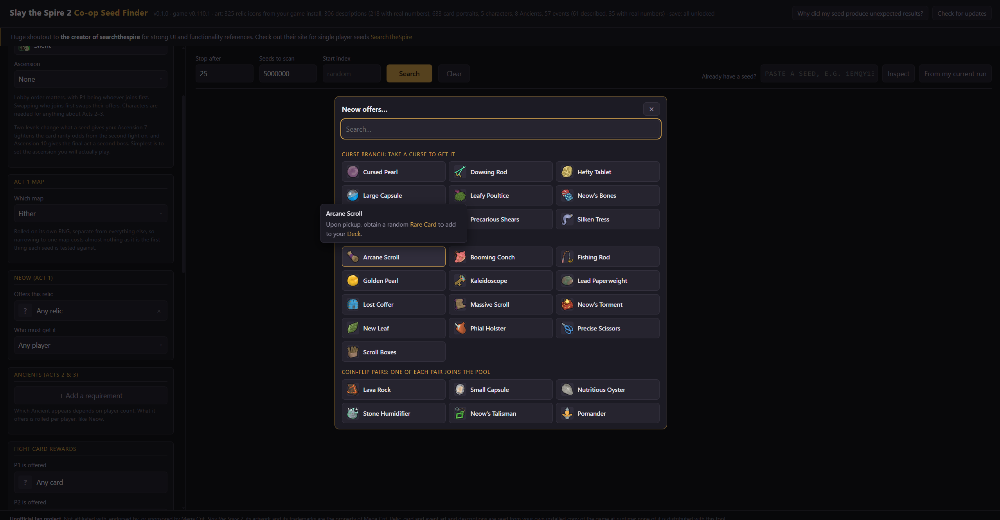
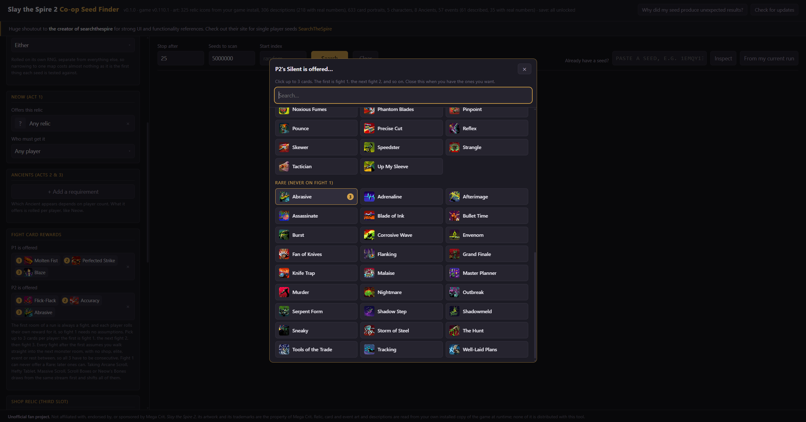
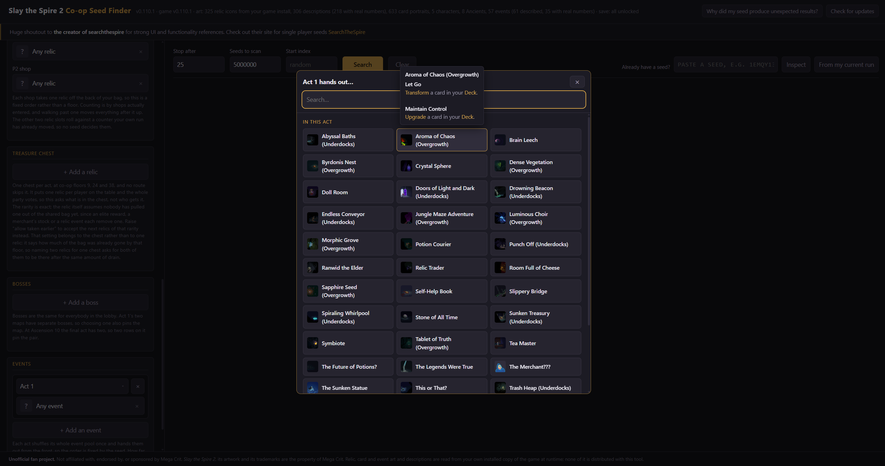

# Descriptions supported for mostly everything in the relic/card/event pickers

Example of all 3 players getting Silken Tress as selected, alongside the selected overgrowth.

UI Picker Examples for relics/cards

UI Picker Examples for events

# Shop and Treasure Chest Pickers identical to the ones above